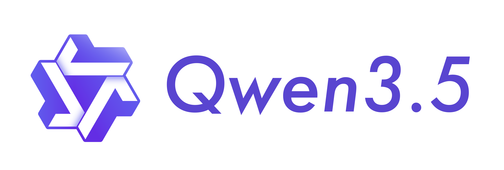

# DomeClaw



🦐 DomeClaw is an ultra-lightweight personal AI Assistant. It is the official continuation and rebrand of [PicoClaw](https://github.com/sipeed/picoclaw), which was inspired by [nanobot](https://github.com/HKUDS/nanobot). DomeClaw is refactored from the ground up in Go through a self-bootstrapping process, where the AI agent itself drove the entire architectural migration and code optimization.

💻 Coded with **Qwen 3.5**

⚡️ Runs on $10 hardware with <10MB RAM: That's 99% less memory than OpenClaw and 98% cheaper than a Mac mini!

---

⚠️ **PRE-RELEASE SOFTWARE - USE AT YOUR OWN RISK**

> DomeClaw is currently in active development and **has not been officially released yet**. The project is not recommended for production use. Features may be incomplete, unstable, or subject to breaking changes without notice. **You assume all risks and responsibilities** when using this software.

---

**📦 Project Info:**
- **Source Code:** https://github.com/domeclaw/domeclaw
- **Issues:** https://github.com/domeclaw/domeclaw/issues
- **Discussions:** https://github.com/domeclaw/domeclaw/discussions

---

## 🆕 New Features: EVM Wallet & Blockchain Support

DomeClaw now supports **EVM-compatible blockchains** with built-in wallet management!

### **🔐 Wallet Features:**
- Create and manage Ethereum wallets
- Check token balances (native & ERC20)
- Transfer tokens
- Interact with smart contracts (read/write)
- Upload and manage contract ABIs
- PIN-protected wallet security

### **🔗 Multi-Chain Support:**
- Configure multiple EVM chains
- Auto-detect token decimals
- Support for both native and ERC20 tokens
- Built-in RPC client with failover

### **📱 Telegram Commands:**
```
/wallet create 1234          # Create wallet with PIN
/wallet info                 # View balance and wallet info
/wallet unlock 1234          # Unlock wallet for transactions
/wallet lock                 # Lock wallet
/wallet abi upload [name]    # Upload contract ABI
/wallet abi list             # List available ABIs
```

### **⛓️ Example Configuration (ClawSwift Chain):**

```json
{
  "wallet": {
    "enabled": true,
    "chains": [
      {
        "name": "ClawSwift",
        "chain_id": 7441,
        "rpc": "https://exp.clawswift.net/rpc",
        "explorer": "https://exp.clawswift.net",
        "currency": "CLAW",
        "is_native": false,
        "gas_token": "0x20c0000000000000000000000000000000000000",
        "gas_token_name": "CLAW"
      }
    ]
  }
}
```

**Configuration Options:**
- `name`: Chain name (e.g., "ClawSwift")
- `chain_id`: EVM chain ID (e.g., 7441)
- `rpc`: RPC endpoint URL
- `explorer`: Block explorer URL
- `currency`: Token symbol
- `is_native`: `true` for native token, `false` for ERC20
- `gas_token`: ERC20 contract address (if `is_native: false`)
- `gas_token_name`: Token name/symbol

---

## 🔥 Hotwallet Mode (AI-Powered Wallet)

DomeClaw includes an **optional hotwallet mode** that allows the AI agent to execute blockchain transactions directly without manual user intervention.

### **Features:**
- **Natural Language Queries**: Ask "What's my balance?" instead of typing commands
- **AI-Executed Transfers**: Say "Send 0.01 CLAW to 0xABC..." and AI handles it
- **Smart Contract Interaction**: Query or write to contracts via conversation
- **Auto PIN Reading**: PIN stored in `~/.domeclaw/workspace/wallet/pin.json`

### **AI Wallet Tools:**
| Tool | Description | Example Query |
|------|-------------|---------------|
| `query_wallet_balance` | AI checks balance directly | "เรามี balance เท่าไหร่" |
| `wallet_auto_transfer` | AI executes transfers | "โอน 0.01 CLAW ให้ 0xABC..." |
| `query_contract_call` | AI reads contract data | "เช็ค balanceOf ที่อยู่นี้" |
| `execute_contract_write` | AI writes to contracts | "approve ให้ 0xDEF..." |

### **⚠️ Security Warning:**

> **HOTWALLET MODE PRIORITIZES CONVENIENCE OVER SECURITY**
>
> - PIN is stored in **plaintext** at `~/.domeclaw/workspace/wallet/pin.json`
> - AI has direct access to wallet keystore and can sign transactions
> - Suitable for **testnet/development ONLY**
> - **NOT RECOMMENDED** for mainnet or wallets holding significant funds
>
> Use at your own risk. For production use, disable wallet or use manual PIN entry only.

---

## 🌐 Gateway HTTP API

DomeClaw provides a **Gateway HTTP API** for programmatic access to the agent and channels.

### **Configuration**

In `~/.domeclaw/config.json`:

```json
{
  "gateway": {
    "host": "0.0.0.0",
    "port": 8080,
    "http_api_port": 8081
  },
  "channels": {
    "webhook": {
      "enabled": true,
      "token": "YOUR_WEBHOOK_TOKEN",
      "host": "0.0.0.0",
      "port": 18795
    }
  }
}
```

**Gateway Configuration:**
- `host`: Gateway server host (default: "0.0.0.0")
- `port`: Gateway server port (default: 8080) - used for health checks and other internal services
- `http_api_port`: **HTTP API port for `/chat` and `/webhook` endpoints** (default: port + 1 if not set)

**Webhook Channel Configuration:**
- `enabled`: Enable/disable webhook channel
- `token`: Authentication token for `/chat` and `/webhook` endpoints
- `host`: Webhook server host (default: "localhost")
- `port`: Webhook server port (default: 18795) - for receiving external webhooks

**Note:**
- Gateway `port` (8080) is for health/status endpoints
- HTTP API endpoints (`/chat`, `/webhook`) run on `http_api_port` (8081 by default)
- Webhook `port` (18795) is for external webhook services (LINE, Discord, etc.)

### **Available Endpoints**

#### **1. POST /chat - Direct Agent Interaction**

Process a message directly through the AI agent and get the response.

**Endpoint:** `http://localhost:8081/chat` (Gateway port + 1)

**Authentication:** Requires `Authorization: Bearer YOUR_WEBHOOK_TOKEN` header or `?token=YOUR_WEBHOOK_TOKEN` query parameter

**Request:**
```bash
curl -X POST http://localhost:8081/chat \
  -H "Authorization: Bearer YOUR_WEBHOOK_TOKEN" \
  -H "Content-Type: application/json" \
  -d '{
    "message": "Hello!",
    "chat_id": "user123",
    "channel": "telegram"
  }'
```

**Response:**
```json
{
  "response": "Hello! How can I help you today?"
}
```

**Parameters:**
- `message` (required): The message content
- `chat_id`: Target chat ID (default: "curl_user")
- `channel`: Target channel - `telegram`, `discord`, `webhook`, etc. (default: "telegram")

**Example - Query Balance:**
```bash
curl -X POST http://localhost:8081/chat \
  -H "Authorization: Bearer test_token" \
  -H "Content-Type: application/json" \
  -d '{
    "message": "What is my balance?",
    "chat_id": "188576201",
    "channel": "telegram"
  }'
```

#### **2. POST /webhook - Queue-Based Processing**

Send a message to be processed by the agent via message queue. Useful for integrating with external webhook services.

**Endpoint:** `http://localhost:8081/webhook`

**Authentication:** Same as `/chat`

**Request with Target Channel:**
```bash
curl -X POST http://localhost:8081/webhook \
  -H "Authorization: Bearer YOUR_WEBHOOK_TOKEN" \
  -H "Content-Type: application/json" \
  -d '{
    "message": ">balance เหลือเท่าไหร่",
    "chat_id": "188576201",
    "metadata": {
      "target_channel": "telegram",
      "target_chat_id": "188576201"
    }
  }'
```

**Response:**
```json
{
  "status": "message queued"
}
```

**Parameters:**
- `message` (required): The message content
- `sender_id`: Sender identifier (default: "webhook")
- `chat_id`: Chat ID
- `event`: Event type (optional)
- `metadata`: Additional data (optional)
  - `target_channel`: Route response to this channel (e.g., "telegram")
  - `target_chat_id`: Send response to this chat ID

**Example - Webhook Integration:**
```bash
# From external service (e.g., LINE, Discord)
curl -X POST http://localhost:8081/webhook \
  -H "Authorization: Bearer test_token" \
  -H "Content-Type: application/json" \
  -d '{
    "message": "Check wallet info",
    "sender_id": "discord_user_123",
    "chat_id": "188576201",
    "metadata": {
      "target_channel": "telegram",
      "target_chat_id": "188576201"
    }
  }'
```

### **Channel Ports Comparison**

| Port | Purpose | Protocol | Example Use Case |
|------|---------|----------|------------------|
| 8081 | Gateway HTTP API | REST API | Direct agent interaction via `/chat`, `/webhook` |
| 18795 | Webhook Channel | Webhook receiver | External services (LINE, Discord) sending messages to DomeClaw |

### **Health Check Endpoints**

```bash
# Gateway health
curl http://localhost:8081/health

# Ready status
curl http://localhost:8081/ready
```

---
